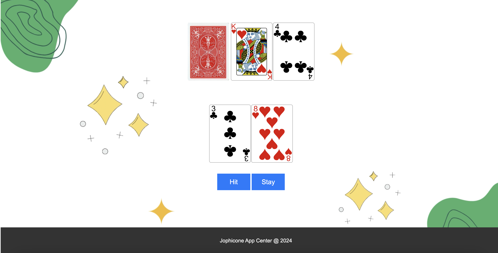

# BlackJackGame

## Description
BlackJackGame is a simple implementation of the classic card game Blackjack (also known as 21). It is designed to be played in the browser and provides a basic interface for players to interact with the game.

## Features
- Player can hit or stay during their turn.
- Dealer plays automatically after the player's turn.
- Game tracks player's and dealer's score.
- Game displays cards for both player and dealer.
- Basic win/lose logic implemented.

## Technologies Used
- HTML
- CSS
- JavaScript
- Python
- Flask

## How to Play
1. Clone or download the repository to your local machine.
2. Open the `index.html` file in your preferred web browser.
3. Follow the on-screen instructions to play the game.
4. Click the "Hit" button to draw another card or "Stay" button to end your turn.
5. After your turn, the dealer will automatically play.
6. The game will display the winner and update scores accordingly.

## Screenshots

## Demo
This is link: https://blackjackgame-1fx3.onrender.com/

## Contributors
- https://github.com/jofiel-nguyen

## License
This project is licensed under the [MIT License](LICENSE).
